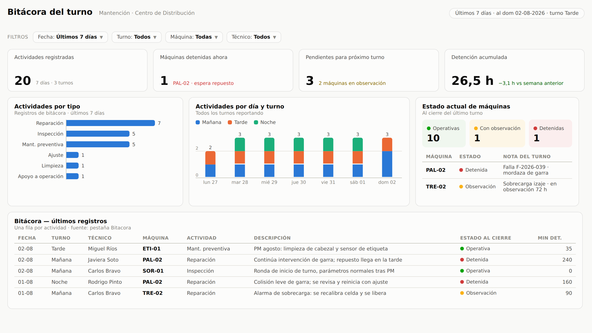
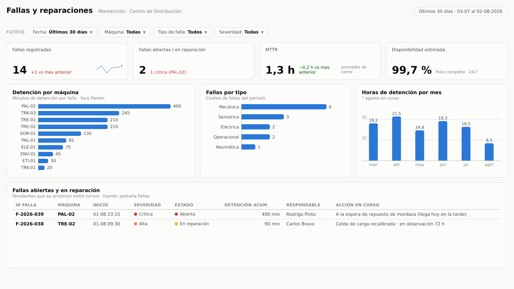
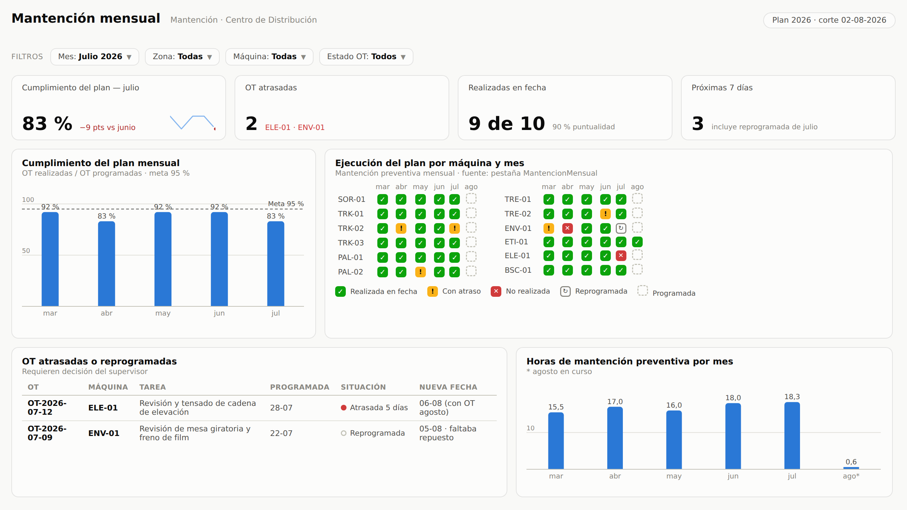

# 📊 Dashboard de Mantención — Centro de Distribución Automatizado

Kit completo para montar un **dashboard de Power BI conectado a Google
Sheets** para el área de mantención de un CD automatizado: bitácora de cada
turno, registro de fallas y reparaciones, y control del cumplimiento de la
mantención mensual (preventiva) de las máquinas.



## Qué resuelve

- **Bitácora de turno**: qué se hizo en cada turno (Mañana/Tarde/Noche), en
  qué estado quedó cada máquina y qué quedó pendiente para el turno siguiente.
- **Fallas y reparaciones**: qué máquina quedó en falla, cuánto tiempo de
  detención genera cada equipo (Pareto), MTTR, disponibilidad y el backlog de
  fallas abiertas que se arrastran entre turnos.
- **Mantención mensual**: si el plan preventivo se está cumpliendo, máquina
  por máquina y mes a mes, con OT atrasadas y reprogramadas a la vista.

## Contenido del kit

```
powerbi-mantencion/
├── plantilla/
│   └── Plantilla_Bitacora_Mantencion.xlsx   ← subir a Google Sheets (5 pestañas,
│                                              listas desplegables y datos de ejemplo)
├── power-query/
│   ├── conector-google-sheets/              ← consultas M, método recomendado (hoja privada)
│   └── csv-enlace-publico/                  ← consultas M, método alternativo sin credenciales
├── dax/
│   ├── 01_tabla_calendario.dax              ← dimensión de fechas
│   ├── 02_medidas.dax                       ← 26 medidas: MTTR, MTBF, disponibilidad,
│   │                                          cumplimiento PM, atrasadas, etc.
│   └── 03_columna_estado_ejecucion.dax      ← semáforo para la matriz de cumplimiento
├── tema/
│   └── tema_mantencion.json                 ← tema visual de Power BI (paleta accesible)
└── docs/
    ├── GUIA_PASO_A_PASO.md                  ← ★ empezar aquí
    └── img/                                 ← maquetas de las 3 páginas
```

## Cómo empezar (resumen)

1. **Google Sheets** — sube `plantilla/Plantilla_Bitacora_Mantencion.xlsx` a
   Drive y guárdala como hoja de cálculo de Google. Ajusta tus máquinas y
   técnicos.
2. **Power BI** — crea el parámetro `URL_GoogleSheets`, pega las 4 consultas
   de `power-query/conector-google-sheets/` y aplica.
3. **Modelo** — crea la tabla `Calendario`, las relaciones y las medidas
   (`dax/`).
4. **Páginas** — aplica `tema/tema_mantencion.json` y construye las 3 páginas
   siguiendo las maquetas y las tablas visual-por-visual de la guía.
5. **Publica** — sube al Power BI Service y programa la actualización
   automática (origen en la nube, sin puerta de enlace).

La guía completa, con capturas y solución de problemas:
**[docs/GUIA_PASO_A_PASO.md](docs/GUIA_PASO_A_PASO.md)**

## Las 3 páginas del dashboard

| | |
|---|---|
|  |  |

**KPIs incluidos:** actividades por turno · pendientes entre turnos ·
máquinas detenidas · horas de detención · N° de fallas y fallas abiertas ·
MTTR · MTBF · disponibilidad estimada · cumplimiento del plan mensual ·
puntualidad de OT · OT atrasadas y próximas · horas de mantención preventiva.

> Los datos de la plantilla son de ejemplo (junio–agosto 2026) para que el
> dashboard se vea poblado al primer intento; bórralos al pasar a producción.
