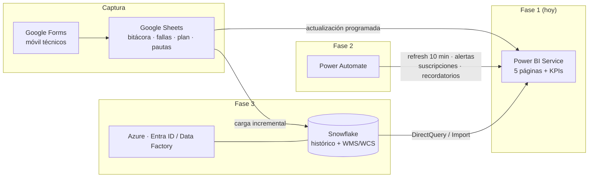

# Arquitectura e integraciones — Azure · Power Automate · Power BI · Snowflake

Hoja de ruta para evolucionar el sistema de mantención usando el software que
ya tiene la empresa. La regla: **cada fase funciona completa por sí sola**;
se avanza a la siguiente solo cuando la anterior está adoptada por el equipo.

## Fase 1 — Lo que ya está construido (Sheets → Power BI)

- Captura amigable: Google Sheets con desplegables + opción Google Forms
  desde el celular (guía, paso 1).
- Power BI Service con actualización programada: **8/día con licencia Pro**,
  ancladas a los turnos (07:30 · 11:00 · 15:30 · 19:00 · 23:30 · 03:00 + 2
  para reuniones). Zona horaria: Santiago.
- Reporte diario del turno (página 4) con suscripción por correo al cierre de
  cada turno; reporte mensual con la página 3 y 5.

## Fase 2 — Power Automate (sin cambiar la arquitectura de datos)

| Flujo | Disparador | Acción | Requisito |
|---|---|---|---|
| **Refresh cada 10 min** | Periodicidad (10 min) | "Actualizar un conjunto de datos" de Power BI | Licencia **Premium Por Usuario** (~US$ 24/usuario/mes); con Pro el tope es 8/día |
| **Alerta de falla crítica** | Alerta de datos de Power BI sobre la tarjeta `Fallas Abiertas (actual)` (umbral ≥ 1) | Notificación a Teams / correo al supervisor | Pro (las alertas de datos funcionan en paneles) |
| **Reporte del turno a Teams** | Periodicidad 07:00 / 15:00 / 23:00 | Exportar página 4 a PDF y publicarla en el canal de mantención | PPU o Premium para exportación vía API (con Pro: usar suscripciones de correo nativas) |
| **Recordatorio de OT** | Periodicidad semanal (lunes 07:00) | Leer fila de `MantencionMensual` (conector de Google Sheets en Automate) y avisar OT atrasadas al planificador | Pro |
| **Respaldo mensual de la hoja** | Periodicidad mensual | Copiar el Sheet a una carpeta de respaldo en Drive/SharePoint | Pro |

## Fase 3 — Snowflake + Azure (cuando crezca el volumen o la gobernanza)

Señales de que llegó el momento: más de ~50 000 filas acumuladas, necesidad
de cruzar con datos del WMS/WCS (para OEE real), varios CD a consolidar, o
exigencias de auditoría/permisos corporativos.

1. **Ingesta**: carga incremental de las pestañas del Sheet a Snowflake
   (Azure Data Factory o un flujo de Power Automate que inserte los
   registros nuevos; también sirve un conector ELT tipo Fivetran/Airbyte).
   El Sheet sigue siendo la captura de los técnicos: no se les cambia la
   herramienta.
2. **Modelo en Snowflake**: las mismas tablas (`BITACORA`, `FALLAS`,
   `MANTENCION`, `MAQUINAS`, `PAUTAS`) más las del WMS/WCS (throughput,
   horas reales de operación por equipo → MTBF y disponibilidad exactos, y
   la pata que falta del OEE).
3. **Power BI sobre Snowflake**: mismas medidas DAX apuntando al nuevo
   origen; con **DirectQuery** el dashboard queda casi en tiempo real sin
   depender de actualizaciones programadas.
4. **Azure**: Entra ID para permisos por rol (técnico / supervisor /
   gerencia) en el workspace de Power BI; Data Factory para orquestar; y si
   la captura necesita validaciones más duras que un Sheet, migrar el
   formulario a **Power Apps** escribiendo directo a Snowflake/Dataverse
   (los dashboards no cambian).

## Qué NO hacer todavía

- No partir por Snowflake: con 20 equipos y decenas de filas diarias, Sheets
  + Power BI resuelve el 100 % del problema con costo cero y captura simple.
- No duplicar la captura (papel + hoja, o dos planillas): una sola fuente.
- No conectar Power BI "en vivo" a la hoja con soluciones caseras: el camino
  soportado para tiempo real es la fase 3 con DirectQuery.
