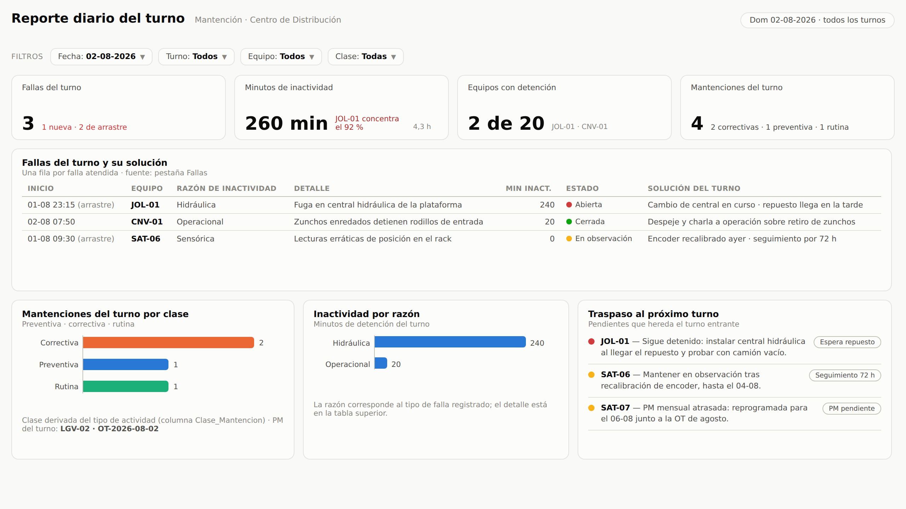
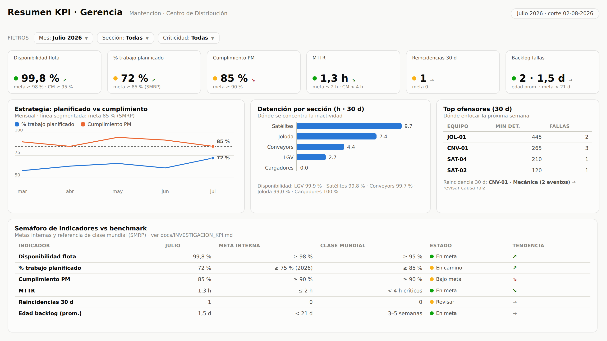
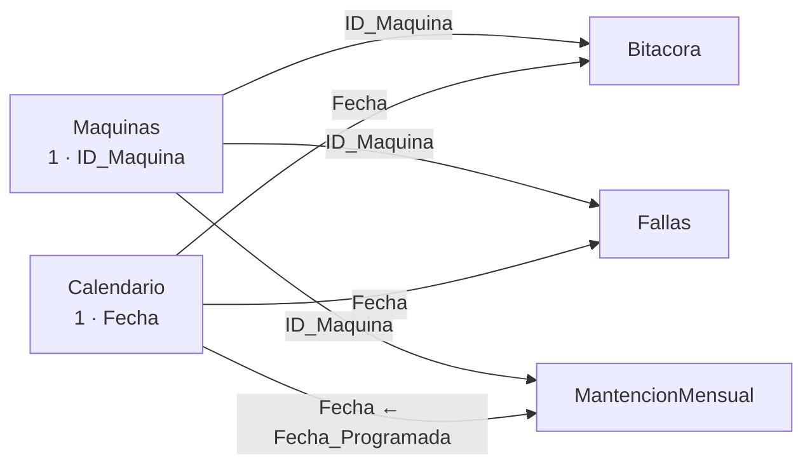
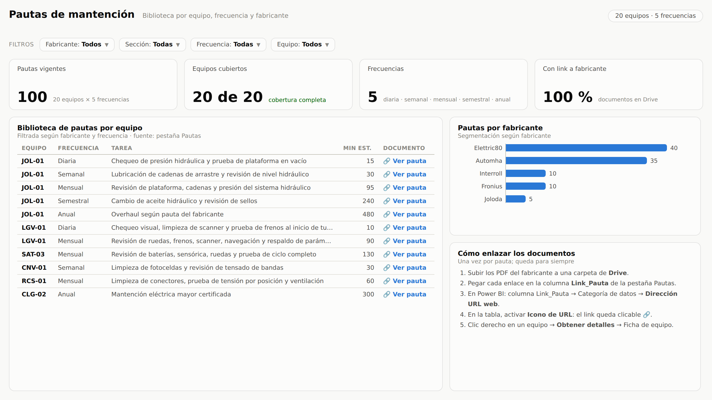
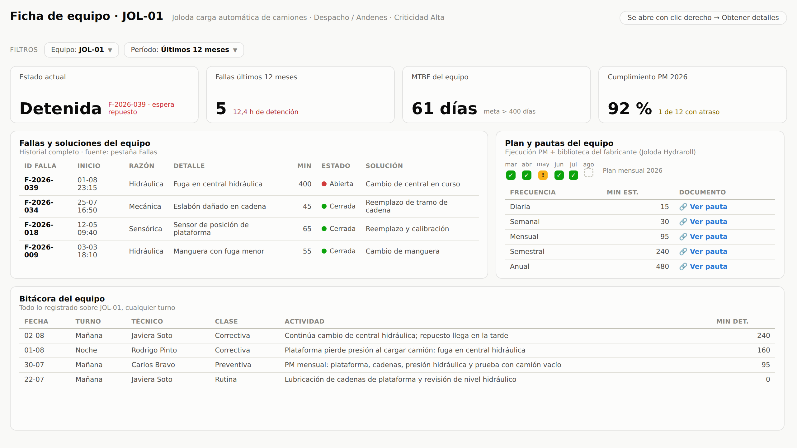

# Guía paso a paso — Dashboard de Mantención (Google Sheets + Power BI)

Esta guía deja funcionando, en unos 30–45 minutos, un dashboard de Power BI
conectado a un Google Sheet donde el equipo registra la bitácora de cada
turno, las fallas/reparaciones y el plan de mantención mensual de las
máquinas del centro de distribución.

**El resultado final son estas 5 páginas** (maquetas de referencia; las
construirás visual por visual en el paso 6):

| Página | Responde a |
|---|---|
| **1 · Bitácora del turno** | ¿Qué se hizo en cada turno? ¿En qué estado quedaron las máquinas? ¿Qué quedó pendiente? |
| **2 · Fallas y reparaciones** | ¿Qué máquinas fallan más? ¿Cuánto tiempo de detención generan? ¿Qué sigue abierto? |
| **3 · Mantención mensual** | ¿Se está cumpliendo el plan de mantención preventiva de cada máquina, mes a mes? |
| **4 · Reporte diario del turno** | ¿Qué problemas hubo hoy en el turno? Fallas por equipo, minutos y razón de inactividad, solución aplicada y mantenciones por clase (preventiva · correctiva · rutina) |
| **5 · Resumen KPI · Gerencia** | ¿Cómo estamos contra metas y benchmarks del rubro? Semáforo de indicadores, % trabajo planificado vs cumplimiento, top ofensores y reincidencias |

---

## Paso 1 — Crear el Google Sheet desde la plantilla

1. Descarga [`plantilla/Plantilla_Bitacora_Mantencion.xlsx`](../plantilla/Plantilla_Bitacora_Mantencion.xlsx).
2. Súbela a Google Drive (`Nuevo → Subir archivo`), ábrela y usa
   `Archivo → Guardar como hoja de cálculo de Google`.
3. Revisa la pestaña **Inicio**: explica qué registra cada pestaña, quién la
   llena y las reglas de formato. Las pestañas de datos son:

   | Pestaña | Contenido | Una fila = |
   |---|---|---|
   | `Bitacora` | actividades de cada turno | una actividad |
   | `Fallas` | fallas y su reparación | una falla (se completa el cierre al repararla) |
   | `MantencionMensual` | plan preventivo y su ejecución (todas las frecuencias: use la columna `Frecuencia`) | una OT por equipo y período |
   | `Maquinas` | catálogo de equipos, con sección (`Tipo`), zona, criticidad y fabricante | una máquina |
   | `Pautas` | pauta de mantención por equipo y frecuencia (diaria → anual) con link al documento del fabricante | una pauta |
   | `Listas` | valores de los desplegables | — |

4. Adapta `Maquinas` a tus equipos reales y la columna `Tecnicos` de `Listas`
   a tu equipo. **No cambies nombres de pestañas ni de columnas**: las
   consultas de Power BI dependen de ellos.
5. Comparte la hoja con los técnicos como **Editor**.
6. Las filas precargadas son datos de ejemplo para probar el dashboard;
   bórralas cuando empiecen a registrar datos reales (dejando los encabezados).

> **Opcional — captura desde el celular con Google Forms:** crea un
> formulario (`Herramientas → Crear un formulario nuevo` desde la hoja) con
> preguntas tituladas **exactamente** como las columnas de `Bitacora`
> (Fecha, Turno, Tecnico, ID_Maquina, Tipo_Actividad, Descripcion,
> Estado_Maquina, Detencion_Min, Pendiente, Observaciones). Las respuestas
> caen en una pestaña nueva; apunta la consulta de Power BI a esa pestaña
> (cambiando `Bitacora` por el nombre de la pestaña de respuestas en la
> consulta) y elimina la columna `Marca temporal` en Power Query si no la
> usas. Así los técnicos registran desde el teléfono al cierre del turno.

## Paso 2 — Conectar Power BI al Google Sheet

Hay dos métodos; usa el **A** salvo que tengas un motivo para el B.

### Método A (recomendado): conector nativo de Google Sheets

La hoja permanece privada; Power BI se conecta con tu cuenta Google.

1. En Power BI Desktop: `Inicio → Administrar parámetros → Nuevo parámetro`
   - Nombre: `URL_GoogleSheets` · Tipo: `Texto`
   - Valor actual: la URL completa de tu hoja
     (`https://docs.google.com/spreadsheets/d/…/edit`).
2. `Inicio → Obtener datos → Consulta en blanco`, abre el
   `Editor avanzado` y pega el contenido de
   [`power-query/conector-google-sheets/Bitacora.m`](../power-query/conector-google-sheets/Bitacora.m).
   Renombra la consulta a `Bitacora` (panel derecho).
3. La primera vez pedirá credenciales: elige iniciar sesión con Google y
   autoriza el acceso de solo lectura.
4. Repite el punto 2 con `Fallas.m`, `MantencionMensual.m`, `Maquinas.m` y
   `Pautas.m` (nombres de consulta: `Fallas`, `MantencionMensual`,
   `Maquinas`, `Pautas`).
5. `Cerrar y aplicar`.

> Si el paso `Hoja` diera error en tu versión de Power BI, borra los pasos
> `Origen` y `Hoja`, conéctate con `Obtener datos → Google Sheets`
> seleccionando la pestaña correspondiente, y conserva los pasos desde
> `Encabezados` hacia abajo. El encabezado de cada archivo `.m` lo explica.

### Método B (alternativo): enlace CSV público

No pide credenciales; requiere que la hoja quede visible para
"cualquier persona con el enlace" (lector). Instrucciones y consultas en
[`power-query/csv-enlace-publico/`](../power-query/csv-enlace-publico/LEEME.md).

## Paso 3 — Tabla Calendario

1. `Modelado → Nueva tabla` → pega el contenido de
   [`dax/01_tabla_calendario.dax`](../dax/01_tabla_calendario.dax).
2. `Herramientas de tabla → Marcar como tabla de fechas` → columna `Fecha`.
3. Columna `Mes` → `Ordenar por columna` → `AnioMes`.
   Columna `DiaSemana` → `Ordenar por columna` → `DiaSemanaNum`.

## Paso 4 — Relaciones del modelo

En la vista **Modelo**, crea estas relaciones (todas 1 → varios, filtro en
una sola dirección):

| Desde (1) | Hacia (varios) | Columnas |
|---|---|---|
| `Maquinas[ID_Maquina]` | `Bitacora[ID_Maquina]` | |
| `Maquinas[ID_Maquina]` | `Fallas[ID_Maquina]` | |
| `Maquinas[ID_Maquina]` | `MantencionMensual[ID_Maquina]` | |
| `Maquinas[ID_Maquina]` | `Pautas[ID_Maquina]` | permite segmentar pautas por fabricante y sección |
| `Calendario[Fecha]` | `Bitacora[Fecha]` | |
| `Calendario[Fecha]` | `Fallas[Fecha]` | la columna `Fecha` la crea la consulta (día de `Fecha_Hora_Falla`) |
| `Calendario[Fecha]` | `MantencionMensual[Fecha_Programada]` | |

En los visuales usa siempre **`Calendario[Fecha]`/`[Mes]`** para ejes y
segmentaciones de fecha, y **`Maquinas[ID_Maquina]`/`[Zona]`** para máquinas.

## Paso 5 — Medidas y columna calculada

1. Crea una tabla contenedora: `Inicio → Especificar datos` → sin columnas,
   nombre `Medidas` → `Cargar`.
2. Clic derecho en `Medidas` → `Nueva medida` → pega **una por una** las
   medidas de [`dax/02_medidas.dax`](../dax/02_medidas.dax) (cada bloque entre
   separadores es una medida; el comentario indica el formato sugerido).
3. En la tabla `MantencionMensual`: `Nueva columna` → pega
   [`dax/03_columna_estado_ejecucion.dax`](../dax/03_columna_estado_ejecucion.dax).

## Paso 6 — Construir las 5 páginas

Aplica primero el tema: `Ver → Temas → Buscar temas →`
[`tema/tema_mantencion.json`](../tema/tema_mantencion.json). Renombra las
páginas como los títulos siguientes y usa las maquetas como referencia visual.

En las tres páginas: agrega arriba las **segmentaciones** (estilo lista
desplegable): `Calendario[Fecha]` (rango relativo), `Maquinas[ID_Maquina]`,
más las específicas de cada página.

### Página 1 · Bitácora del turno

Segmentaciones extra: `Bitacora[Turno]`, `Bitacora[Tecnico]`.

| Visual | Tipo | Campos / medida |
|---|---|---|
| Actividades registradas | Tarjeta | `[Actividades]` |
| Máquinas detenidas ahora | Tarjeta | `[Maquinas Con Falla Abierta]` |
| Pendientes próximo turno | Tarjeta | `[Actividades Pendientes]` |
| Detención acumulada | Tarjeta | `[Horas Detencion Bitacora]` |
| Actividades por tipo | Barras horizontales | Eje Y: `Bitacora[Tipo_Actividad]` · Eje X: `[Actividades]` |
| Actividades por día y turno | Columnas apiladas | Eje X: `Calendario[Fecha]` · Leyenda: `Bitacora[Turno]` · Valores: `[Actividades]` |
| Estado actual de máquinas | Tabla | `Maquinas[ID_Maquina]`, último `Bitacora[Estado_Maquina]`, `Bitacora[Observaciones]` — filtra el visual a Estado ≠ "Operativa" |
| Bitácora — últimos registros | Tabla | `Fecha, Turno, Tecnico, ID_Maquina, Tipo_Actividad, Descripcion, Estado_Maquina, Detencion_Min` — ordena por Fecha desc. |

> Formato condicional sugerido en la columna `Estado_Maquina`:
> Operativa = verde `#0CA30C` · Operativa con Observación = ámbar `#FAB219` ·
> Detenida = rojo `#D03B3B` (iconos o color de fondo).

### Página 2 · Fallas y reparaciones

Segmentaciones extra: `Fallas[Tipo_Falla]`, `Fallas[Severidad]`.

| Visual | Tipo | Campos / medida |
|---|---|---|
| Fallas registradas | Tarjeta | `[Numero Fallas]` |
| Fallas abiertas / en reparación | Tarjeta | `[Fallas Abiertas (actual)]` |
| MTTR | Tarjeta | `[MTTR Horas]` |
| Disponibilidad estimada | Tarjeta | `[Disponibilidad %]` |
| Detención por máquina | Barras horizontales | Eje Y: `Maquinas[ID_Maquina]` · Eje X: `[Minutos Detencion Fallas]` · orden descendente (Pareto) |
| Fallas por tipo | Barras horizontales | Eje Y: `Fallas[Tipo_Falla]` · Eje X: `[Numero Fallas]` |
| Horas de detención por mes | Columnas | Eje X: `Calendario[Mes]` · Valores: `[Horas Detencion Fallas]` |
| Fallas abiertas y en reparación | Tabla | `ID_Falla, ID_Maquina, Fecha_Hora_Falla, Severidad, Estado, Detencion_Min, Tecnico_Responsable, Reparacion_Realizada` — filtro del visual: `Estado` ≠ Cerrada |

> KPIs útiles de agregar cuando el equipo madure: `[MTBF Horas]` y
> `[Fallas Criticas]`.

### Página 3 · Mantención mensual

Segmentaciones extra: `Calendario[Mes]`, `Maquinas[Zona]`,
`MantencionMensual[Estado]`.

| Visual | Tipo | Campos / medida |
|---|---|---|
| Cumplimiento del plan | Tarjeta | `[Cumplimiento PM %]` |
| OT atrasadas | Tarjeta | `[OT Atrasadas]` |
| Realizadas en fecha | Tarjeta | `[OT Realizadas En Fecha]` + `[Puntualidad PM %]` |
| Próximas 7 días | Tarjeta | `[OT Proximas 7 Dias]` |
| Cumplimiento del plan mensual | Columnas | Eje X: `Calendario[Mes]` · Valores: `[Cumplimiento PM %]` · agrega una **línea de constante Y = 0,95** (Análisis → Línea de constante) como meta |
| Ejecución del plan por máquina y mes | **Matriz** | Filas: `Maquinas[ID_Maquina]` · Columnas: `Calendario[Mes]` · Valores: primera `MantencionMensual[Estado Ejecucion]` |
| OT atrasadas o reprogramadas | Tabla | `ID_OT, ID_Maquina, Tarea, Fecha_Programada, Estado Ejecucion, Observaciones` — filtro: `Estado Ejecucion` ∈ {Atrasada, Reprogramada} |
| Horas de PM por mes | Columnas | Eje X: `Calendario[Mes]` · Valores: `[Horas PM Ejecutadas]` |

> **Formato condicional de la matriz** (el visual clave de la página):
> selecciona la matriz → `Formato → Elementos de celda → Color de fondo → fx`
> → estilo **Reglas**, campo `Estado Ejecucion` (Primero):
> `Realizada en fecha` → `#0CA30C` · `Realizada con atraso` → `#FAB219` ·
> `Atrasada` → `#D03B3B` · `Reprogramada` → `#898781` · `Programada` →
> `#E1E0D9`. Con eso cada celda queda como un semáforo por máquina y mes.

### Página 4 · Reporte diario del turno

La página de cierre operativo: **un día (y opcionalmente un turno) a la
vista**, con los problemas del turno, la inactividad y su razón, la solución
aplicada y las mantenciones clasificadas. La clasificación
Preventiva / Correctiva / Rutina la calcula automáticamente la consulta
`Bitacora` (columna `Clase_Mantencion`) a partir del tipo de actividad, así
que **no hay que registrar nada nuevo en la hoja**:

| `Tipo_Actividad` registrado | `Clase_Mantencion` |
|---|---|
| Mantención Preventiva | Preventiva |
| Reparación | Correctiva |
| Inspección · Limpieza · Lubricación · Ajuste · Cambio de Batería | Rutina |
| Apoyo a Operación · Capacitación · Otro | Otra |

Segmentaciones: `Calendario[Fecha]` (estilo **lista desplegable, selección
única** — la página se mira un día a la vez), `Bitacora[Turno]`,
`Maquinas[ID_Maquina]`, `Bitacora[Clase_Mantencion]`.

| Visual | Tipo | Campos / medida |
|---|---|---|
| Fallas del turno | Tarjeta | `[Numero Fallas]` |
| Minutos de inactividad | Tarjeta | `[Minutos Detencion Fallas]` |
| Equipos con detención | Tarjeta | `[Equipos Con Falla]` |
| Mantenciones del turno | Tarjeta | `[Actividades]` + `[Mantenciones Correctivas]`, `[Mantenciones Preventivas]`, `[Mantenciones de Rutina]` |
| Fallas del turno y su solución | Tabla | `Fecha_Hora_Falla, ID_Maquina, Tipo_Falla` (razón), `Descripcion_Falla, Detencion_Min, Estado, Reparacion_Realizada` (solución) |
| Mantenciones del turno por clase | Barras horizontales | Eje Y: `Bitacora[Clase_Mantencion]` · Eje X: `[Actividades]` |
| Inactividad por razón | Barras horizontales | Eje Y: `Fallas[Tipo_Falla]` · Eje X: `[Minutos Detencion Fallas]` |
| Traspaso al próximo turno | Tabla | `Bitacora`: `ID_Maquina, Descripcion, Observaciones` — filtro del visual: `Pendiente` = "Sí" |

> Notas de esta página:
> - Para ver también las fallas **de arrastre** (abiertas de días anteriores)
>   en la tabla, usa como filtro de página `Fallas[Estado]` ≠ Cerrada **o**
>   fecha = día seleccionado (o duplica la tabla: "nuevas del día" y
>   "arrastradas").
> - En Power BI Service puedes crear una **suscripción por correo** a esta
>   página (Suscribirse → diaria a las 07:00 / 15:00 / 23:00) para que el
>   reporte del turno llegue solo a jefatura al cierre de cada turno.

### Página 5 · Resumen KPI · Gerencia

La vista ejecutiva, construida según las prácticas del rubro (máximo 6
indicadores, cada uno **contra su meta y el benchmark de clase mundial**,
con semáforo y tendencia). Las metas y sus fuentes están documentadas en
[`INVESTIGACION_KPI.md`](INVESTIGACION_KPI.md) — ajusta las metas internas a
tu realidad y súbelas año a año.

Segmentaciones: `Calendario[Mes]`, `Maquinas[Tipo]` (sección),
`Maquinas[Criticidad]`.

| Visual | Tipo | Campos / medida |
|---|---|---|
| Disponibilidad flota | Tarjeta | `[Disponibilidad %]` · meta ≥ 98 % |
| % trabajo planificado | Tarjeta | `[% Trabajo Planificado]` · meta ≥ 85 % (SMRP) |
| Cumplimiento PM | Tarjeta | `[Cumplimiento PM %]` · meta ≥ 90 % |
| MTTR | Tarjeta | `[MTTR Horas]` · meta ≤ 2 h |
| Reincidencias | Tarjeta | `[Fallas Reincidentes 30d]` · meta 0 |
| Backlog | Tarjeta | `[Fallas Abiertas (actual)]` + `[Antiguedad Backlog Dias]` |
| Estrategia: planificado vs cumplimiento | Líneas | Eje X: `Calendario[Mes]` · Valores: `[% Trabajo Planificado]`, `[Cumplimiento PM %]` · línea de constante Y = 0,85 |
| Detención por sección | Barras horizontales | Eje Y: `Maquinas[Tipo]` · Eje X: `[Horas Detencion Fallas]` |
| Top ofensores | Tabla | `Maquinas[ID_Maquina]`, `[Minutos Detencion Fallas]`, `[Numero Fallas]` — Top 5 por detención |
| Semáforo vs benchmark | Tabla | Una fila por KPI con valor, meta y benchmark; usa iconos de formato condicional para el estado |

> Para los semáforos de las tarjetas: `Formato → fx` sobre el color del
> texto/fondo con reglas (verde si cumple meta, ámbar cerca, rojo bajo).

### Página extra · Pautas de mantención por equipo

Con la tabla `Pautas` cargada puedes armar la biblioteca de pautas
segmentada según fabricante:

1. **Preparar el link**: sube los PDF de las pautas del fabricante a una
   carpeta de Drive/SharePoint y pega cada enlace en la columna
   `Link_Pauta` de la pestaña `Pautas` (la plantilla trae marcadores
   `REEMPLAZAR`).
2. En Power BI, selecciona la columna `Link_Pauta` → `Herramientas de
   columna → Categoría de datos → Dirección URL web`.
3. Crea la página con: segmentaciones `Maquinas[Fabricante]`,
   `Maquinas[Tipo]`, `Pautas[Frecuencia]`, `Maquinas[ID_Maquina]` + una
   **tabla** con `ID_Maquina, Frecuencia, Tarea, Duracion_Min_Est,
   Link_Pauta`. En el formato de la tabla activa `Valores → Icono de URL`
   para que el link se muestre como ícono clicable 🔗.

**Dónde vive cada frecuencia del plan:**

| Frecuencia | Se planifica en | Se registra en | Se controla con |
|---|---|---|---|
| Diaria / Semanal | `Pautas` (checklist de rutina) | `Bitacora` (Tipo\_Actividad Inspección/Limpieza/etc.) | `[Mantenciones de Rutina]`, actividades por día (página 1) |
| Mensual / Bimestral / Trimestral | `MantencionMensual` (columna `Frecuencia`) | misma fila (Fecha\_Realizada) | matriz página 3, `[Cumplimiento PM %]` |
| Semestral / Anual | `MantencionMensual` (columna `Frecuencia`) | misma fila | tabla de OT filtrada por `Frecuencia` |

> Las OT diarias no se cargan una a una al plan (serían 600 filas/mes):
> la rutina diaria/semanal se controla por la bitácora contra la pauta.

### Página extra · Ficha de equipo (obtención de detalles)

La vista que enlaza todo por equipo — su bitácora, sus fallas y soluciones,
sus pautas y su historial de plan:

1. Crea una página `Ficha equipo` y en el panel **Visualizaciones →
   Obtención de detalles** arrastra `Maquinas[ID_Maquina]`.
2. Agrega: tarjetas con `Maquinas[Nombre]`, `[Numero Fallas]`,
   `[Horas Detencion Fallas]`, `[MTBF Horas]`, `[Cumplimiento PM %]`; tabla
   de su bitácora; tabla de sus fallas con `Reparacion_Realizada`; tabla de
   sus `Pautas` con el link; y la matriz de ejecución PM filtrada.
3. Desde **cualquier** visual de las otras páginas: clic derecho sobre un
   equipo → `Obtener detalles → Ficha equipo`. Así el reporte diario y el
   mensual quedan enlazados a la bitácora de cada equipo.

## Paso 7 — Publicar y automatizar

1. `Inicio → Publicar` → elige tu área de trabajo de Power BI Service.
2. En Power BI Service: `Conjunto de datos → Configuración → Credenciales de
   origen de datos` → inicia sesión (método A: cuenta Google; método B:
   acceso anónimo).
3. `Actualización programada`: actívala (p. ej. cada 4 horas; con licencia
   Pro son hasta 8 actualizaciones al día). No se necesita puerta de enlace:
   Google Sheets es un origen en la nube.
4. Comparte el informe con jefatura y supervisores, e instala la app móvil
   de Power BI para revisarlo en terreno.
5. Automatizaciones siguientes (refresh cada 10 min con PPU + Power
   Automate, alertas de falla crítica a Teams, integración futura con
   Snowflake/Azure): ver
   [`ARQUITECTURA_INTEGRACION.md`](ARQUITECTURA_INTEGRACION.md).

## Rutina de uso sugerida

| Momento | Quién | Qué hace |
|---|---|---|
| Durante el turno | Técnico | Registra fallas al ocurrir (fila en `Fallas`) |
| Cierre de turno (10 min) | Técnico | Llena `Bitacora`: actividades, estado de máquinas, pendientes |
| Al reparar | Técnico | Completa `Fecha_Hora_Cierre`, `Detencion_Min`, `Reparacion_Realizada` y pasa `Estado` a `Cerrada` |
| Inicio de mes | Supervisor | Carga las OT del mes en `MantencionMensual` |
| Al ejecutar una OT | Técnico | Completa `Fecha_Realizada`, `Duracion_Min` y `Estado = Realizada` |
| Reunión semanal | Supervisor | Revisa página 2 (Pareto de fallas) y página 3 (atrasadas) del dashboard |

## Solución de problemas

| Síntoma | Causa probable | Solución |
|---|---|---|
| `Expression.Error: no se encontró la columna X` | Renombraron una columna o pestaña en el Sheet | Restaurar el nombre exacto (ver plantilla) |
| Fechas con error al actualizar | Fecha escrita como texto libre | Usar formato `AAAA-MM-DD`; la columna de la plantilla ya lo trae |
| La consulta trae filas en blanco o basura | Filas vacías intermedias o totales manuales en la pestaña | No dejar filas en blanco ni agregar totales dentro de las pestañas de datos |
| Método B: la consulta devuelve HTML/error | La hoja no está compartida "cualquier persona con el enlace: lector" | Ajustar el acceso o usar el método A |
| No aparece actualización programada | Credenciales sin configurar en el Service | Paso 7.2 |
| La matriz muestra números en vez de estados | En Valores quedó un conteo | Usar `Estado Ejecucion` con agregación **Primero** |
| `[OT Atrasadas]` no coincide con lo esperado | OT vencidas quedaron con estado `Programada` de meses anteriores | Es correcto: sigue contando hasta que se realicen o reprogramen |
